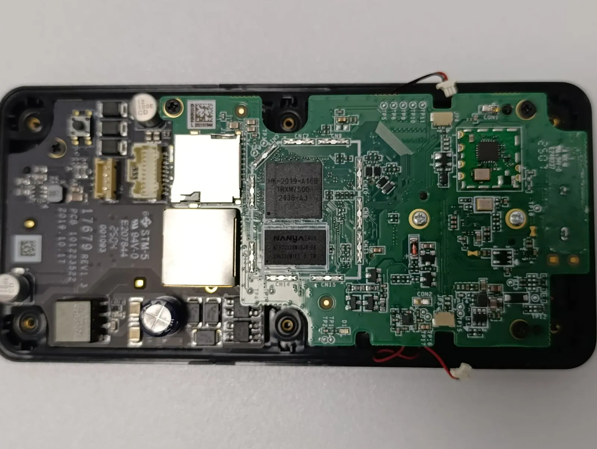
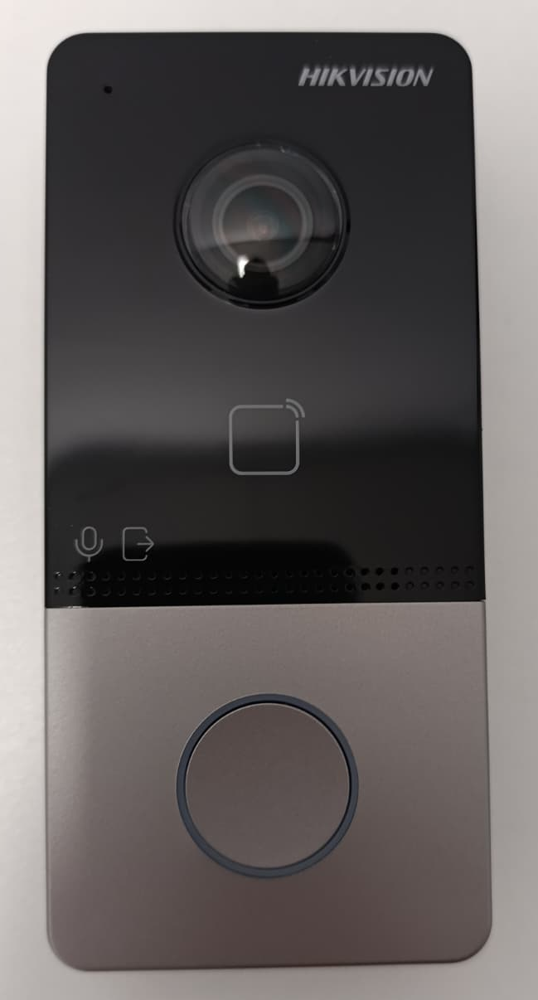
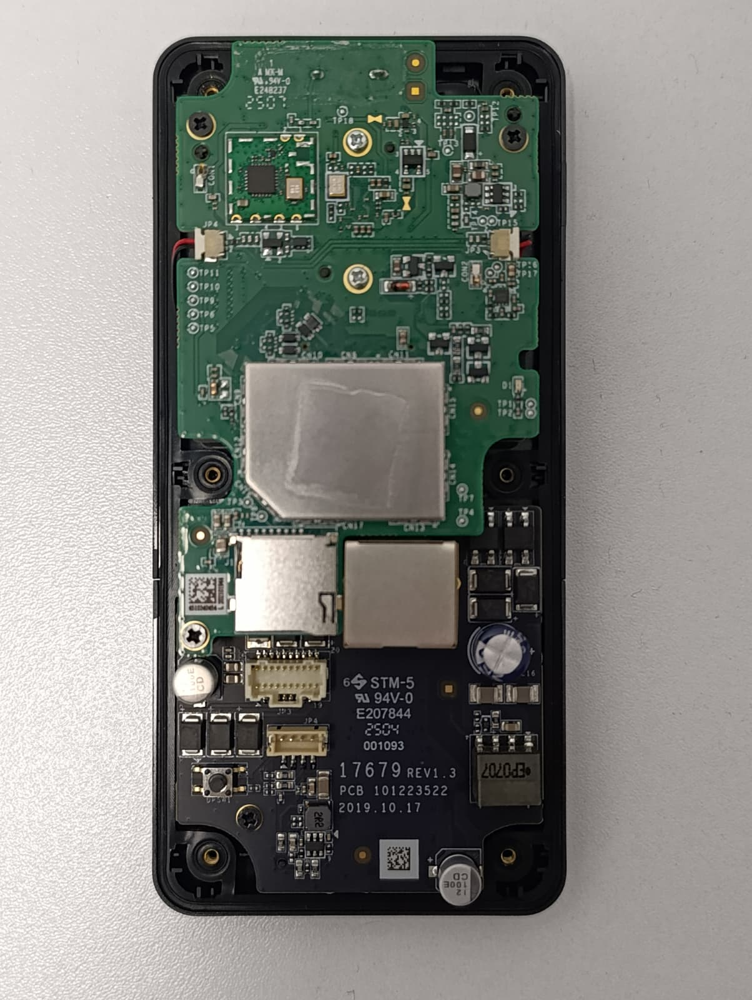
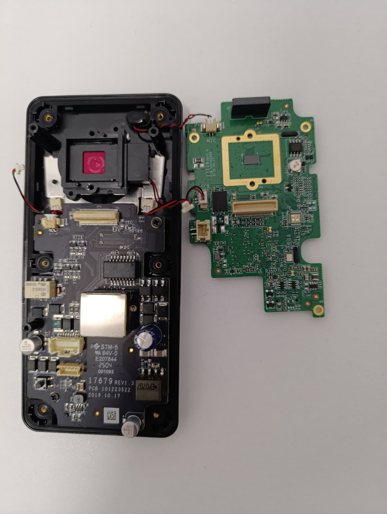
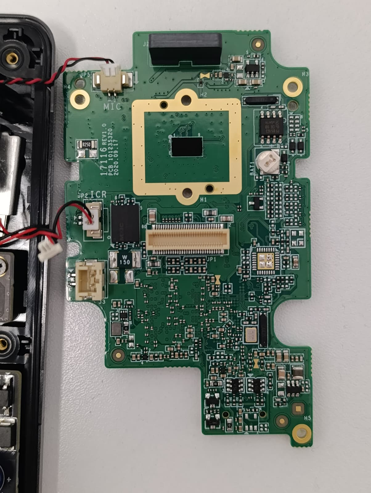
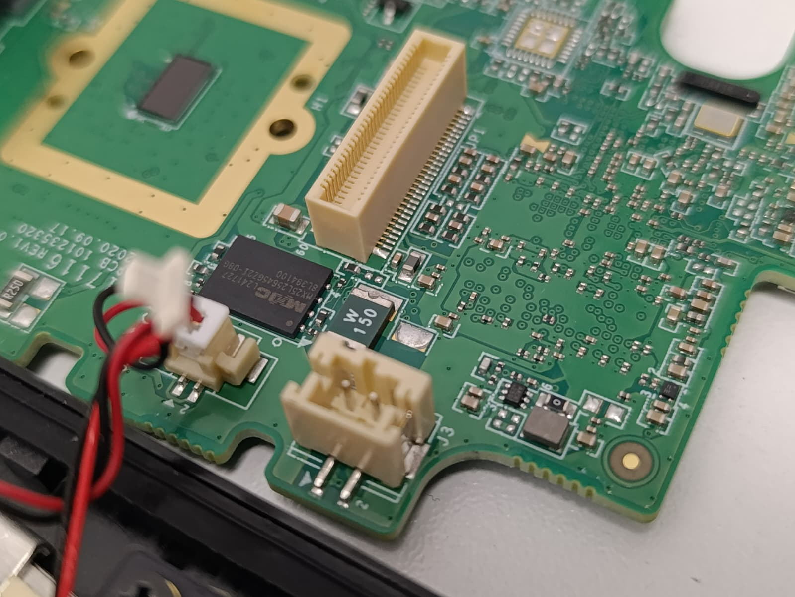
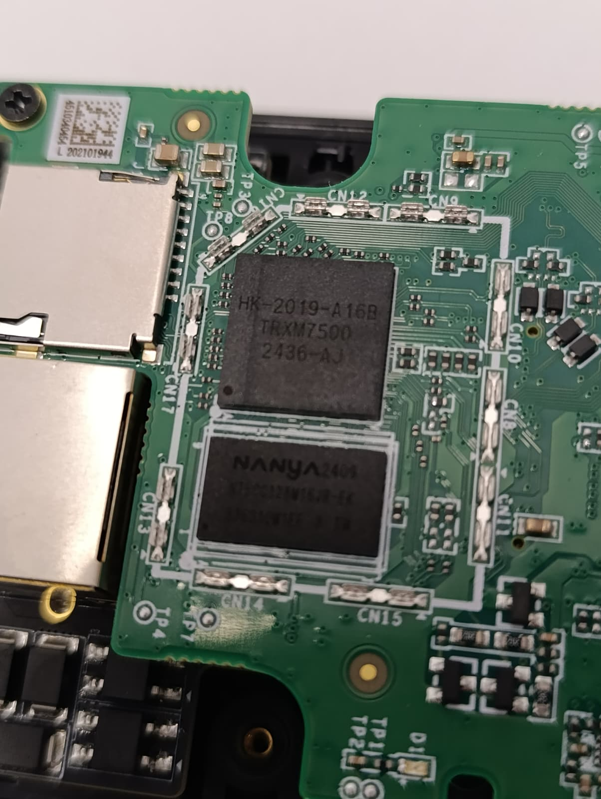

<link  rel="shortcut icon"  type="image/x-icon"  href="icon.ico">
<figure>  
</figure>

# Introduction

Commercial videointercom systems are found in front of most buildings, public or residential. While older models use analog systems to call and display video, these are gradually phased out, as cheaper digital systems take over market and use modern TCP/IP networking.

One such device is the Hikvision DS-KV6113-WPE1 IP Video Intercom system, which aims to bring TCP/IP and video calling to affordable standards. As with most cheap devices, there has to be a corner-cut in costs somewhere, and this article will hopefully shed some light on the current state of security this particular model implements.
  

# PCB Analysis

The device has 2 PCBs that are connected via a mezzanine connector. The black PCB holds the majority of the connectors, including the RJ45 and exterior-facing connectors, as well as the PoE and voltage regulation circuitry.

The microprocessor is an HK-2019-A16B TRXM7500, specially made for Hikvision. The flash IC, MX25L25645G holds 256Mb of memory and holds the entire firmware of the device.  

