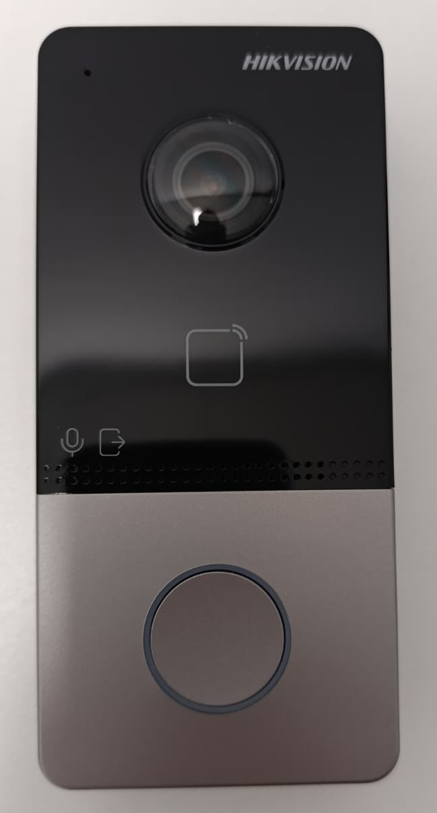
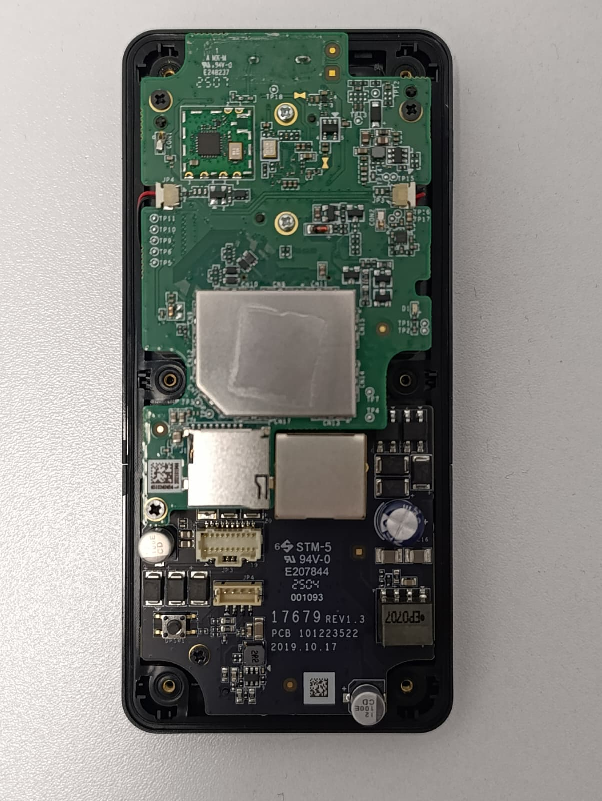
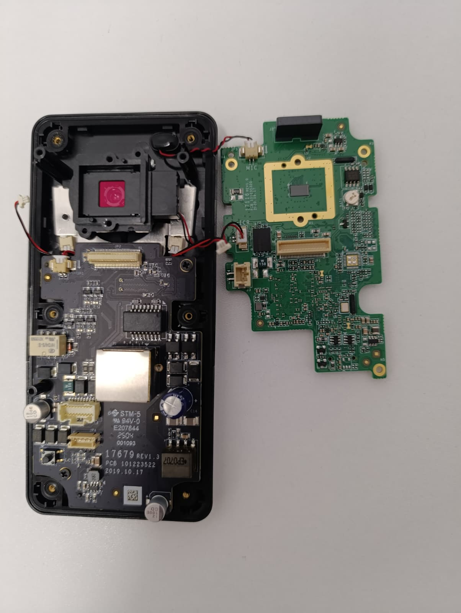
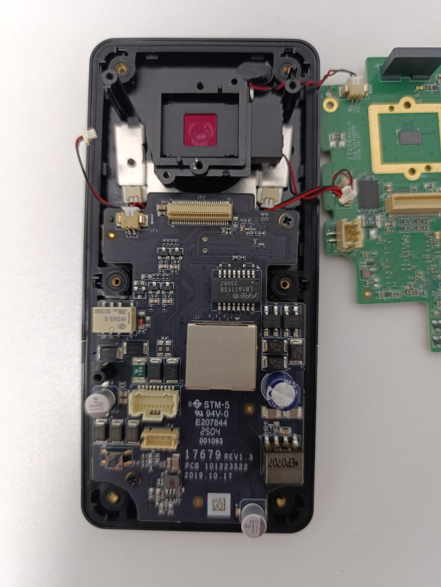
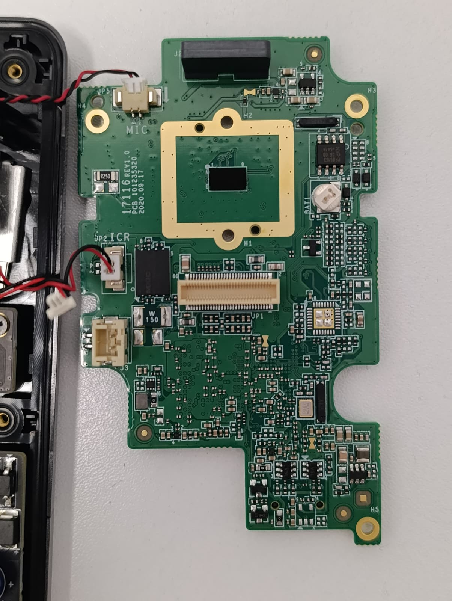
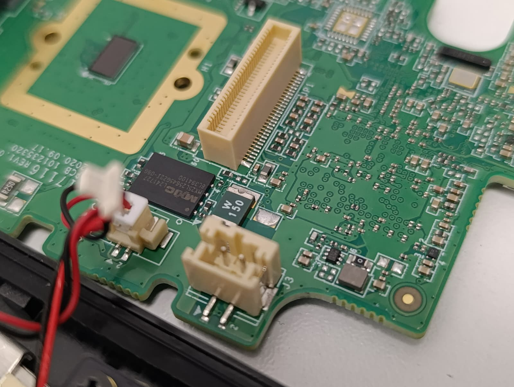
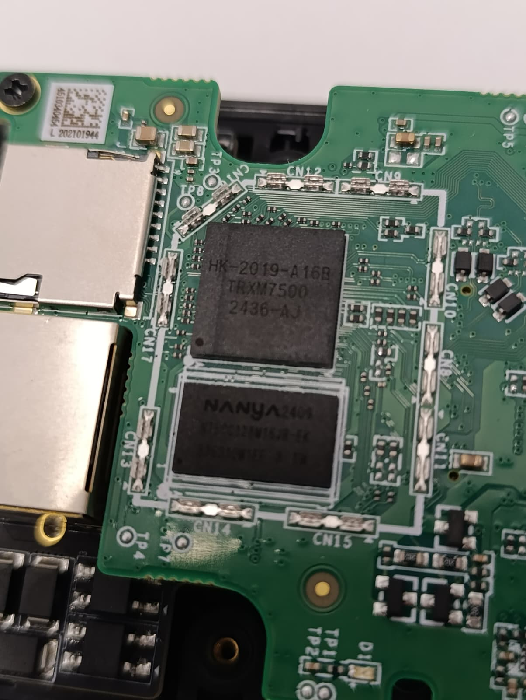

<link rel="shortcut icon" type="image/x-icon" href="icon.ico">
<link rel="stylesheet" href="https://cdn.jsdelivr.net/npm/swiper@12/swiper-bundle.min.css">

<style>
/* ── Gallery ──────────────────────────────────────────────────────────── */
.pcb-swiper{
  max-width: 980px;
  margin: 1rem auto 0.75rem;
  border-radius: 16px;
  overflow: hidden;
  box-shadow: 0 12px 40px rgba(0,0,0,.10);
  background: rgba(0,0,0,.02);
}
.pcb-swiper .swiper-slide{
  display:flex;
  align-items:center;
  justify-content:center;
  background: rgba(0,0,0,.02);
}
.pcb-swiper .swiper-zoom-container{
  width:100%;
  height: min(72vh, 760px);
  display:flex;
  align-items:center;
  justify-content:center;
}
.pcb-swiper img{
  width:100%;
  height:100%;
  object-fit: contain;
  display:block;
  user-select: none;
  -webkit-user-drag: none;
}
.pcb-gallery-controls{
  max-width: 980px;
  margin: 0 auto 2rem;
  display:flex;
  align-items:center;
  justify-content:space-between;
  gap: 12px;
}
.pcb-gallery-controls button{
  border:0;
  cursor:pointer;
  padding:10px 14px;
  border-radius:12px;
  background: rgba(0,0,0,.06);
  box-shadow: 0 1px 4px rgba(0,0,0,.12);
  font-size: 1rem;
}
.pcb-gallery-controls button:focus{
  outline:2px solid #4c9ffe;
  outline-offset:2px;
}
#pcb-caption{
  flex: 1;
  text-align:center;
  padding: 10px 12px;
  border-radius: 12px;
  background: rgba(0,0,0,.03);
  box-shadow: inset 0 0 0 1px rgba(0,0,0,.08);
  font-size: 0.95rem;
  overflow:hidden;
  text-overflow: ellipsis;
  white-space: nowrap;
}

/* ── Verdict box ──────────────────────────────────────────────────────── */
.verdict{
  border-left: 5px solid #c0392b;
  background: #1a2332;
  color: #ecf0f1;
  padding: 18px 22px;
  border-radius: 0 8px 8px 0;
  margin: 1.5rem 0;
  font-size: 1.05rem;
  line-height: 1.6;
}
.verdict strong{ color: #e74c3c; }

/* ── Severity badges ──────────────────────────────────────────────────── */
.badge{
  display: inline-block;
  font-size: 0.72rem;
  font-weight: 700;
  letter-spacing: 0.06em;
  padding: 2px 8px;
  border-radius: 4px;
  vertical-align: middle;
  margin-right: 6px;
}
.badge-critical{ background:#c0392b; color:#fff; }
.badge-high    { background:#e67e22; color:#fff; }
.badge-medium  { background:#f1c40f; color:#1a1a1a; }

/* ── Findings list ────────────────────────────────────────────────────── */
.findings{
  list-style: none;
  padding: 0;
  margin: 1rem 0 1.5rem;
}
.findings li{
  padding: 10px 14px;
  border-radius: 6px;
  margin-bottom: 8px;
  background: rgba(0,0,0,.03);
  box-shadow: inset 0 0 0 1px rgba(0,0,0,.07);
  line-height: 1.5;
}

/* ── CTA button ───────────────────────────────────────────────────────── */
.cta{
  display: inline-block;
  margin: 1rem 0 0.5rem;
  padding: 11px 24px;
  background: #1a2332;
  color: #fff !important;
  border-radius: 8px;
  font-weight: 600;
  text-decoration: none !important;
  box-shadow: 0 4px 14px rgba(0,0,0,.18);
  transition: background 0.15s;
}
.cta:hover{ background: #c0392b; }

/* ── Stats strip ──────────────────────────────────────────────────────── */
.stats{
  display: flex;
  flex-wrap: wrap;
  gap: 12px;
  margin: 1.2rem 0;
}
.stat{
  flex: 1 1 120px;
  text-align: center;
  padding: 14px 10px;
  border-radius: 10px;
  background: rgba(0,0,0,.04);
  box-shadow: inset 0 0 0 1px rgba(0,0,0,.08);
}
.stat .num{
  display: block;
  font-size: 1.6rem;
  font-weight: 700;
  color: #c0392b;
  line-height: 1.2;
}
.stat .lbl{
  font-size: 0.78rem;
  color: #666;
  letter-spacing: 0.04em;
}

/* ── Dark mode ────────────────────────────────────────────────────────── */
@media (prefers-color-scheme: dark){
  .pcb-swiper{ background: rgba(255,255,255,.06); }
  .pcb-swiper .swiper-slide{ background: rgba(255,255,255,.06); }
  .pcb-gallery-controls button{ background: rgba(255,255,255,.10); color: inherit; }
  #pcb-caption{ background: rgba(255,255,255,.08); box-shadow: inset 0 0 0 1px rgba(255,255,255,.12); }
  .findings li{ background: rgba(255,255,255,.05); box-shadow: inset 0 0 0 1px rgba(255,255,255,.10); }
  .stat{ background: rgba(255,255,255,.06); box-shadow: inset 0 0 0 1px rgba(255,255,255,.10); }
  .stat .lbl{ color: #aaa; }
  .cta{ background: #c0392b; }
  .cta:hover{ background: #e74c3c; }
}
</style>

<script src="https://cdn.jsdelivr.net/npm/swiper@12/swiper-bundle.min.js" defer></script>
<script src="./js/pcb-gallery.js" defer></script>

# Hikvision DS-KV6113-WPE1(C) — Security Analysis

**Researcher:** Andrei Vladescu &nbsp;·&nbsp; **Date:** 2026-05-10 &nbsp;·&nbsp; **Status:** Draft — Phase 2 ongoing

<div class="verdict">
<strong>Verdict: critically poor security posture.</strong> The device ships with intentional backdoors, cryptographic keys shared across every unit on the market, an EOL kernel carrying 3,856 CVEs with Metasploit-ready exploits, and actively exfiltrates biometric data to Hikvision cloud infrastructure — all without user knowledge or consent.
</div>

---

## Key Findings

<ul class="findings">
  <li><span class="badge badge-critical">CRITICAL</span> <strong>Shared TLS private key hardcoded in firmware</strong> — identical across every deployed unit; full MITM trivially achievable from the public firmware image.</li>
  <li><span class="badge badge-critical">CRITICAL</span> <strong>Backdoor shell (<code>psh</code>) with 4 hardcoded RSA public keys</strong> — Hikvision's own service-access mechanism grants root to anyone who computes the challenge response offline.</li>
  <li><span class="badge badge-critical">CRITICAL</span> <strong>Linux 3.18.20 kernel — 3,856 CVEs, 95 exploits</strong> — includes Dirty COW (CVE-2016-5195) and two overlayfs exploits with Metasploit modules; rated "probable" for this kernel.</li>
  <li><span class="badge badge-high">HIGH</span> <strong>Face recognition images uploaded to Hikvision cloud</strong> — biometric data of building visitors sent without consent, in apparent violation of GDPR Article 9.</li>
  <li><span class="badge badge-high">HIGH</span> <strong>93 % of binaries lack RELRO, 84 % lack stack canaries</strong> — <code>hicore</code> alone has 300 <code>strcpy</code> calls, 41 <code>system()</code> calls, and 2,659 potential format string bugs.</li>
</ul>

<div class="stats">
  <div class="stat"><span class="num">4,000</span><span class="lbl">Total CVEs</span></div>
  <div class="stat"><span class="num">105</span><span class="lbl">Public exploits</span></div>
  <div class="stat"><span class="num">12</span><span class="lbl">Metasploit modules</span></div>
  <div class="stat"><span class="num">15</span><span class="lbl">Findings</span></div>
  <div class="stat"><span class="num">4,380</span><span class="lbl">CWE issues</span></div>
</div>

<a class="cta" href="REPORT.md">Read the Full Report →</a>

---

## Introduction

Commercial video intercom systems are found at the entrance of most buildings. Older analog systems are steadily being replaced by TCP/IP-connected units that offer video calling, face recognition, and cloud management at consumer prices. The Hikvision DS-KV6113-WPE1(C) is one such device — widely deployed in residential and commercial buildings across Europe and Asia.



This research analyses the firmware extracted directly from the device's flash chip via chip-off read, covering static binary analysis, automated CVE correlation, cryptographic material extraction, and privacy-relevant behavior discovery.

---

## PCB Analysis

The device uses two PCBs joined via a mezzanine connector. The primary board carries the **HK-2019-A16B TRXM7500** SoC (Hikvision custom, Hi3516CV300 core) and the **MX25L25645G** 256Mbit SPI NOR flash IC — the sole persistent storage for the entire firmware. The secondary board handles PoE, voltage regulation, and external connectors.

The flash IC sits exposed on the PCB surface with no epoxy potting, making chip-off extraction straightforward.

<div class="swiper pcb-swiper" id="pcb-swiper">
  <div class="swiper-wrapper">
    <div class="swiper-slide" data-caption="Back shield — EMI shielding can removed">
      <div class="swiper-zoom-container">
        
      </div>
    </div>
    <div class="swiper-slide" data-caption="Mezzanine connector joining the two PCBs">
      <div class="swiper-zoom-container">
        
      </div>
    </div>
    <div class="swiper-slide" data-caption="RJ45 and PoE circuitry on the secondary PCB">
      <div class="swiper-zoom-container">
        
      </div>
    </div>
    <div class="swiper-slide" data-caption="Secondary PCB — connectors and voltage regulation">
      <div class="swiper-zoom-container">
        
      </div>
    </div>
    <div class="swiper-slide" data-caption="Image sensor area and MX25L25645G flash IC">
      <div class="swiper-zoom-container">
        
      </div>
    </div>
    <div class="swiper-slide" data-caption="HK-2019-A16B TRXM7500 SoC — closeup">
      <div class="swiper-zoom-container">
        
      </div>
    </div>
  </div>
</div>

<div class="pcb-gallery-controls">
  <button type="button" id="pcb-prev" aria-label="Previous image">‹ Prev</button>
  <div id="pcb-caption">Back shield — EMI shielding can removed</div>
  <button type="button" id="pcb-next" aria-label="Next image">Next ›</button>
</div>

---

## Firmware Analysis

### Extraction

The MX25L25645G was de-soldered and read with a flash programmer, yielding a 32 MB binary image. `binwalk3` identified four regions:

| Offset | Type | Contents |
|---|---|---|
| `0x00000` | Raw | U-Boot bootloader |
| `0x60438` | JFFS2 | `dev.bin` device config |
| `0xA02E0` | JFFS2 | Backup config, **shared TLS key pair** |
| `0x1E0000` | CramFS | Main system, kernel, ramdisk, **shared TLS key pair** |

The U-Boot region reveals a UART debug console on `ttyS0` at 115200 baud — physical access to the PCB test points would give an unauthenticated root shell.

### What's inside the CramFS

Beyond the Linux 3.18.20 kernel and ramdisk, notable files include:

- `start.sh` — **encrypted** boot script, decrypted at runtime by `digicapkeyArm.ko` (a ring-0 Hikvision proprietary kernel module)
- `serverkey.pem` / `servercert.pem` — the shared RSA private key; also present in the backup JFFS2
- `hicore` — the main application binary (~several MB, stripped); source of nearly all critical findings
- 11 device-tree blobs for different hardware variants

### Ramdisk

```
/
├── bin/
│   ├── psh          ← backdoor shell (4 hardcoded RSA public keys)
│   └── busybox, hik debug tools
├── etc/
│   ├── dropbear/    ← shared SSH host keys (identical on all units)
│   ├── shadow       ← unsalted SHA-256 root hash, unchanged since 2012
│   └── profile      ← calls psh on every interactive login
└── sbin/ usr/
```

### Automated Analysis — EMBA

The full image was processed by [EMBA](https://github.com/e-m-b-a/emba), covering CVE correlation, binary hardening audit, CWE static analysis, Ghidra/semgrep decompilation, credential scanning, and kernel exploit matching.

---

## Standout Discoveries

### Hikvision built a backdoor into every device

`/bin/psh` is installed as the interactive shell for **every authenticated session** — SSH, Telnet, UART — via `/etc/profile`. It's not a shell. It presents a numeric challenge and waits for a response computed from four hardcoded 1024-bit RSA public keys embedded in the binary:

```
[PSWD][0042]:_
```

Supply the correct answer (computable offline from the embedded keys) and the binary responds:

```
You know
```

Root access granted. On any unit. Ever shipped. The string `RSA_new faild` — note the typo — confirms the key-loading code is homegrown. This is not a bug that crept in; it is an intentional Hikvision service-access mechanism.

---

### Every device on the planet shares the same TLS private key

`serverkey.pem` and `servercert.pem` are baked into the firmware in plaintext — and appear in **two separate partitions**, so reflashing one doesn't fix it:

```
Subject:   C=CN, ST=ZJ, L=HZ, O=HIKVISION, OU=HZ, CN=hikvision.com
Issued:    2019-12-17
Expires:   2037-12-31  (18-year validity)
Key:       RSA 2048-bit, self-signed
Serial:    8a:b4:23:17:c6:2a:20:f1
```

Every DS-KV6113-WPE1(C) presents this same certificate. Anyone who has downloaded the firmware — which is publicly available — holds the private key for your device's TLS session.

---

### Your visitors' faces are being sent to China

The `alarm_2000` module inside `hicore` uploads face-recognition captures and access-control events to Hikvision cloud via S3-style bucket POSTs. The source paths are right there in the binary strings:

```
accessControl/authorityManagement/authInfoUpload.c
accessControl/eventCtrl/event_upload.c
```

The SQLite schema stored on-device tells the rest of the story:

```sql
CREATE TABLE face_param (
    inter_orbital_distance, max_distance, eco_mode_enable,
    enable_mask, pass_contral, ir_1vn_masktonormal_sim ...);
```

Four hardcoded cloud endpoints — including `www.hikvision.com/RaCM/trackExt/ver10` — are called without any user-visible opt-in or disclosure.

---

### The root password hasn't changed since 28 December 2012

```
root:8c9a60a87ff34a9e6c70a986aa4a9e14b237fcd4126f77107298c8afd86248d3:15595:0:99999:7:::
```

Day `15595` in Unix epoch-days is **2012-12-28**. The hash is unsalted SHA-256 — the same value on every unit ever manufactured. John the Ripper couldn't crack it in an hour, but that's now irrelevant: the hash is public, and GPU-accelerated cracking against a custom wordlist can run indefinitely.

The GECOS field — normally a human-readable name — is a 64-character hex string that appears to be a device identifier, suggesting the password was set programmatically and never intended to be changed by users.

---

### QA test infrastructure shipped in production firmware

Buried in the `hicore` binary, alongside the cloud endpoints, is this URL:

```
http://10.19.132.120:6120/pic?=d61if98e*b8ai034-59562b--49a411810d50fi0b6*=ids1*=idp1*
```

`10.19.132.120` is an internal Hikvision RFC-1918 address. The obfuscated parameter string looks like a test-harness artifact. It was never stripped before the release build. A second internal address, `10.192.74.191`, also appears with no documentation of its purpose.

---

<a class="cta" href="REPORT.md">Full Report with all 15 findings →</a>
